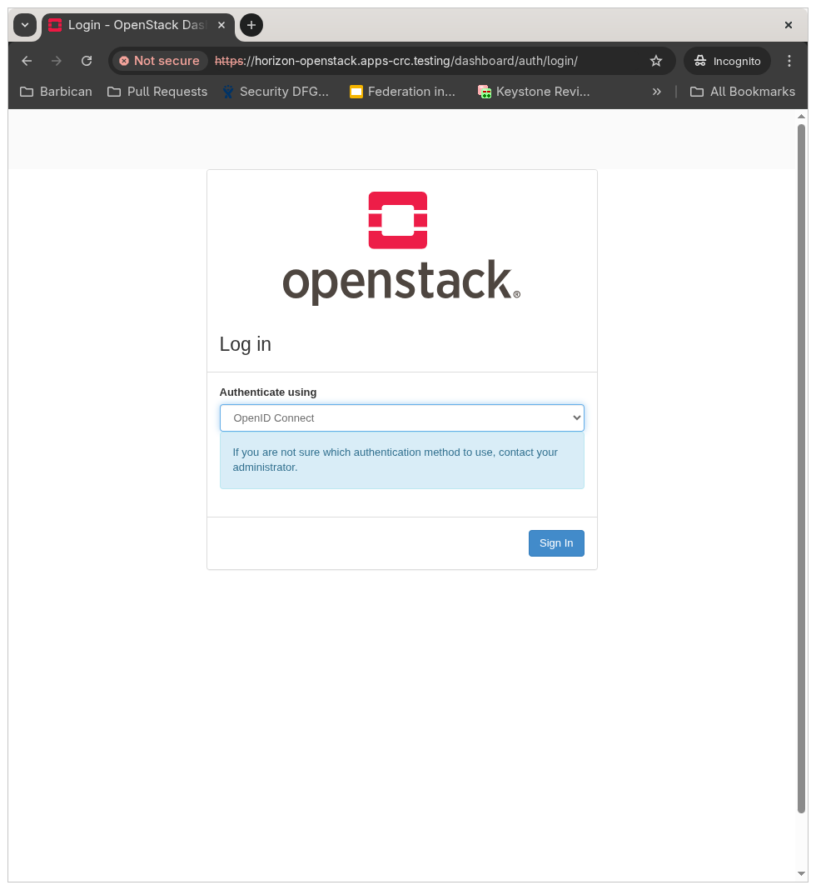
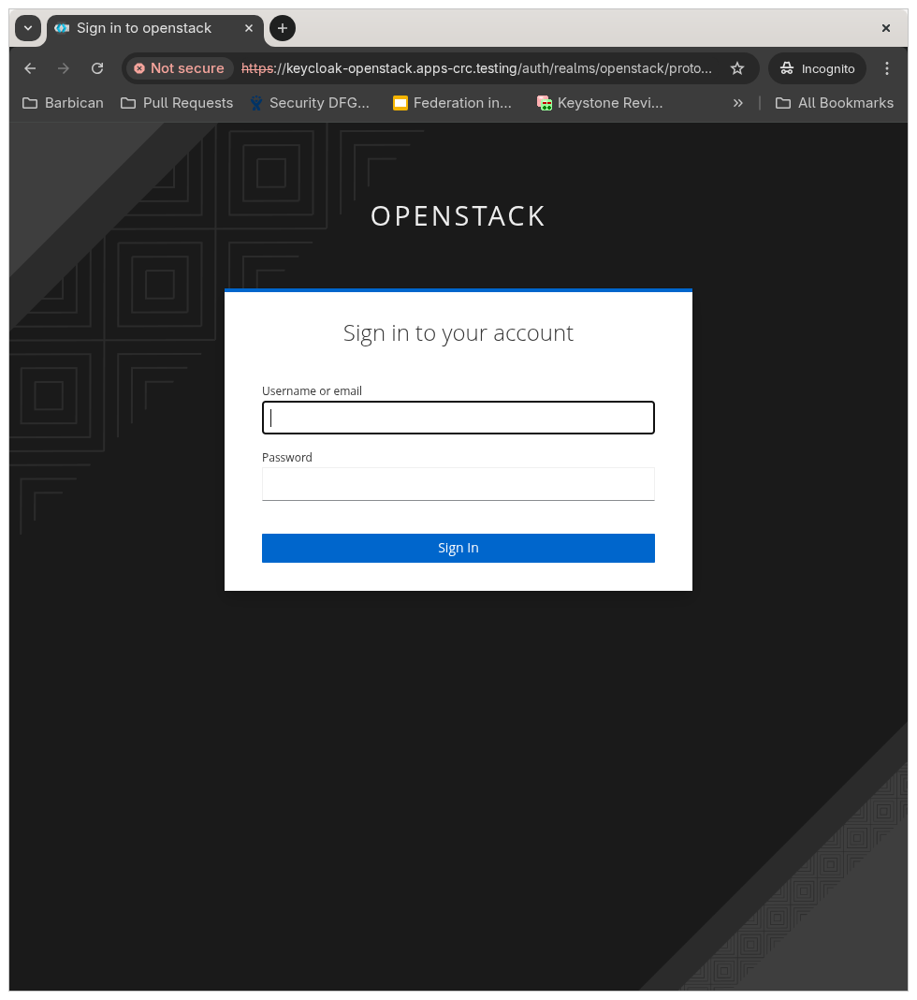
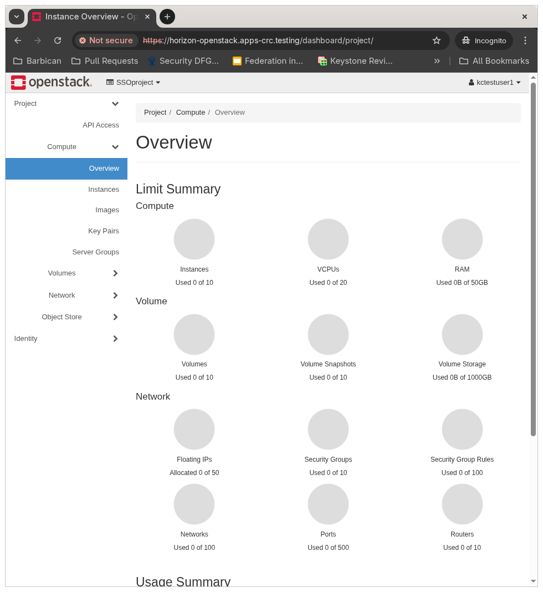

# Federation Deploy

### Files

rhsso-operator-olm.yaml

~~~bash
apiVersion: operators.coreos.com/v1
kind: OperatorGroup
metadata:
  name: rhsso-operator-group
spec:
  targetNamespaces:
  - openstack
---
apiVersion: operators.coreos.com/v1alpha1
kind: Subscription
metadata:
  name: rhsso-operator
spec:
  channel: stable
  installPlanApproval: Manual
  name: rhsso-operator
  source: redhat-operators
  sourceNamespace: openshift-marketplace
~~~

credential-sso.yaml

~~~bash
apiVersion: v1
kind: Secret
type: Opaque
metadata:
  name: credential-sso
  namespace: openstack
data:
  ADMIN_USERNAME: YWRtaW4= # echo -n "admin" | base64
  ADMIN_PASSWORD: bm9tb3Jlc2VjcmV0cw== # echo -n "nomoresecrets" | base64
~~~

sso.yaml

~~~bash
apiVersion: keycloak.org/v1alpha1
kind: Keycloak
metadata:
  name: sso
  labels:
    app: sso
spec:
  instances: 1
  externalAccess:
    enabled: True
~~~

rules.json

~~~bash
[
  {
    "local": [
        {
            "user": {
             "name": "{0}"
        },
        "group": {
            "name": "SSOgroup",
            "domain": {
                "name": "SSO"
            }
          }
        }
    ],
    "remote": [
      {
        "type": "OIDC-preferred_username"
      }
    ]
  }
]
~~~

get-token.sh

~~~bash
#!/bin/bash
source /home/cloud-admin/$1
openstack token issue -f json
# For debugging
# openstack token issue -vvv -f json
~~~

kctestuser1

~~~bash
unset OS_CLOUD
export OS_CACERT=/etc/pki/ca-trust/extracted/pem/tls-ca-bundle.pem
export OS_PROJECT_NAME="SSOproject"
export OS_PROJECT_DOMAIN_NAME="SSO"
export OS_AUTH_URL="https://keystone-public-openstack.apps-crc.testing/v3"
export OS_IDENTITY_API_VERSION=3
export OS_AUTH_PLUGIN=openid
export OS_AUTH_TYPE=v3oidcpassword
export OS_USERNAME="kctestuser1"
export OS_PASSWORD="nomoresecrets1"
export OS_IDENTITY_PROVIDER="kcIDP"
export OS_CLIENT_ID="rhoso"
export OS_CLIENT_SECRET="COX8bmlKAWn56XCGMrKQJj7dgHNAOl6f"
export OS_OPENID_SCOPE="openid profile email"
export OS_PROTOCOL=openid
export OS_ACCESS_TOKEN_TYPE=access_token
export OS_DISCOVERY_ENDPOINT="https://keycloak-openstack.apps-crc.testing/auth/realms/openstack/.well-known/openid-configuration"
~~~

keystone-httpd-override.yaml

~~~bash
apiVersion: v1
kind: Secret
metadata:
  name: keystone-httpd-override
  namespace: openstack
type: Opaque
stringData:
  federation.conf: |
    OIDCClaimPrefix "OIDC-"
    OIDCResponseType "id_token"
    OIDCScope "openid email profile"
    OIDCClaimDelimiter ";"
    OIDCPassUserInfoAs "claims"
    OIDCPassClaimsAs "both"
    OIDCProviderMetadataURL "https://keycloak-openstack.apps-crc.testing/auth/realms/openstack/.well-known/openid-configuration"
    OIDCClientID "rhoso"
    OIDCClientSecret "COX8bmlKAWn56XCGMrKQJj7dgHNAOl6f"
    OIDCCryptoPassphrase "openstack"
    OIDCOAuthClientID "rhoso"
    OIDCOAuthClientSecret "COX8bmlKAWn56XCGMrKQJj7dgHNAOl6f"
    OIDCOAuthIntrospectionEndpoint "https://keycloak-openstack.apps-crc.testing/auth/realms/openstack/protocol/openid-connect/token/introspect"
    OIDCRedirectURI "https://keystone-public-openstack.apps-crc.testing/v3/auth/OS-FEDERATION/identity_providers/kcIDP/protocols/openid/websso/"
    LogLevel debug

    <LocationMatch "/v3/auth/OS-FEDERATION/identity_providers/kcIDP/protocols/openid/websso">
      AuthType "openid-connect"
      Require valid-user
    </LocationMatch>

    <Location ~ "/v3/OS-FEDERATION/identity_providers/kcIDP/protocols/openid/auth">
      AuthType oauth20
      Require valid-user
    </Location>

    <LocationMatch "/v3/auth/OS-FEDERATION/websso/openid">
      AuthType "openid-connect"
      Require valid-user
    </LocationMatch>
~~~

keycloak_realm.yaml

~~~bash
- name: Run federation SSO setup
  hosts: "{{ cifmw_target_host | default('localhost') }}"
  gather_facts: true
  tasks:
  - name: set my facts
    ansible.builtin.set_fact:
      cifmw_federation_keycloak_url: "https://keycloak-openstack.apps-crc.testing"
      cifmw_federation_keycloak_admin_username: admin
      cifmw_federation_keycloak_admin_password: nomoresecrets
      cifmw_federation_keycloak_realm: openstack
      cifmw_federation_keycloak_client_id: rhoso
      cifmw_federation_keystone_url: "https://keystone-public-openstack.apps-crc.testing"
      cifmw_federation_keycloak_client_secret: COX8bmlKAWn56XCGMrKQJj7dgHNAOl6f
      cifmw_federation_horizon_url: "https://horizon-openstack.apps-crc.testing"
      cifmw_federation_keycloak_url_validate_certs: false
      cifmw_federation_keycloak_testgroup1_name: kctestgroup1
      cifmw_federation_keycloak_testgroup2_name: kctestgroup2
      cifmw_federation_keycloak_testuser1_username: kctestuser1
      cifmw_federation_keycloak_testuser1_password: nomoresecrets1
      cifmw_federation_keycloak_testuser2_username: kctestuser2
      cifmw_federation_keycloak_testuser2_password: nomoresecrets2

  - name: Create a Keycloak realm
    community.general.keycloak_realm:
      auth_client_id: admin-cli
      validate_certs: false
      auth_keycloak_url: "{{ cifmw_federation_keycloak_url }}/auth"
      auth_realm: master
      auth_username: "{{ cifmw_federation_keycloak_admin_username }}"
      auth_password: "{{ cifmw_federation_keycloak_admin_password }}"
      id: "{{ cifmw_federation_keycloak_realm }}"
      realm: "{{ cifmw_federation_keycloak_realm }}"
      enabled: true
      state: present

  - name: Create Keycloak client
    community.general.keycloak_client:
      auth_client_id: admin-cli
      validate_certs: false
      auth_keycloak_url: "{{ cifmw_federation_keycloak_url }}/auth"
      auth_realm: master
      auth_username: "{{ cifmw_federation_keycloak_admin_username }}"
      auth_password: "{{ cifmw_federation_keycloak_admin_password }}"
      state: present
      realm: "{{ cifmw_federation_keycloak_realm }}"
      client_id: "{{ cifmw_federation_keycloak_client_id }}"
      name: 'RHOSO Client'
      description: 'RHOSO client for keystone federation'
      root_url: "{{ cifmw_federation_keystone_url }}"
      admin_url: "{{ cifmw_federation_keystone_url }}"
      base_url: '/dashboard/project'
      enabled: true
      client_authenticator_type: client-secret
      secret: "{{ cifmw_federation_keycloak_client_secret }}"
      redirect_uris:
        - "{{ cifmw_federation_keystone_url }}/v3/auth/OS-FEDERATION/identity_providers/kcIDP/protocols/openid/websso/"
        - "{{ cifmw_federation_keystone_url }}/v3/auth/OS-FEDERATION/websso/openid"
        - "{{ cifmw_federation_horizon_url }}/dashboard/auth/websso/"
      web_origins:
        - "{{ cifmw_federation_keystone_url }}"
        - "{{ cifmw_federation_horizon_url }}"
      bearer_only: false
      public_client: false
      implicit_flow_enabled: true
      protocol: openid-connect

  - name: Create a Keycloak group1
    community.general.keycloak_group:
      auth_client_id: admin-cli
      validate_certs: "{{ cifmw_federation_keycloak_url_validate_certs }}"
      auth_keycloak_url: "{{ cifmw_federation_keycloak_url }}/auth"
      auth_realm: master
      auth_username: "{{ cifmw_federation_keycloak_admin_username }}"
      auth_password: "{{ cifmw_federation_keycloak_admin_password }}"
      state: present
      name: "{{ cifmw_federation_keycloak_testgroup1_name }}"
      realm: "{{ cifmw_federation_keycloak_realm }}"

  - name: Create a Keycloak group2
    community.general.keycloak_group:
      auth_client_id: admin-cli
      validate_certs: "{{ cifmw_federation_keycloak_url_validate_certs }}"
      auth_keycloak_url: "{{ cifmw_federation_keycloak_url }}/auth"
      auth_realm: master
      auth_username: "{{ cifmw_federation_keycloak_admin_username }}"
      auth_password: "{{ cifmw_federation_keycloak_admin_password }}"
      state: present
      name: "{{ cifmw_federation_keycloak_testgroup2_name }}"
      realm: "{{ cifmw_federation_keycloak_realm }}"

  - name: Create keycloak user1
    community.general.keycloak_user:
      auth_client_id: admin-cli
      validate_certs: "{{ cifmw_federation_keycloak_url_validate_certs }}"
      auth_keycloak_url: "{{ cifmw_federation_keycloak_url }}/auth"
      auth_realm: master
      auth_username: "{{ cifmw_federation_keycloak_admin_username }}"
      auth_password: "{{ cifmw_federation_keycloak_admin_password }}"
      state: present
      realm: "{{ cifmw_federation_keycloak_realm }}"
      username: "{{ cifmw_federation_keycloak_testuser1_username }}"
      firstName: firstname1
      lastName: lastname1
      email: "{{ cifmw_federation_keycloak_testuser1_username }}@ocp.openstack.lab"
      enabled: true
      emailVerified: false
      credentials:
        - type: password
          value: "{{ cifmw_federation_keycloak_testuser1_password }}"
          temporary: false
      groups:
        - name: "{{ cifmw_federation_keycloak_testgroup1_name }}"
          state: present

  - name: Create keycloak user2
    community.general.keycloak_user:
      auth_client_id: admin-cli
      validate_certs: "{{ cifmw_federation_keycloak_url_validate_certs }}"
      auth_keycloak_url: "{{ cifmw_federation_keycloak_url }}/auth"
      auth_realm: master
      auth_username: "{{ cifmw_federation_keycloak_admin_username }}"
      auth_password: "{{ cifmw_federation_keycloak_admin_password }}"
      state: present
      realm: "{{ cifmw_federation_keycloak_realm }}"
      username: "{{ cifmw_federation_keycloak_testuser2_username }}"
      firstName: firstname2
      lastName: lastname2
      email: "{{ cifmw_federation_keycloak_testuser2_username }}@ocp.openstack.lab"
      enabled: true
      emailVerified: false
      credentials:
        - type: password
          value: "{{ cifmw_federation_keycloak_testuser2_password }}"
          temporary: false
      groups:
        - name: "{{ cifmw_federation_keycloak_testgroup2_name }}"
          state: present
~~~

### Steps

~~~bash
oc apply -f rhsso-operator-olm.yaml
oc get installplan -n openstack
oc patch installplan <NAME> -n openstack --type=merge --patch '{"spec":{"approved":true}}'
# To check what was created:
#   oc get installplan -n openstack
#   oc get csv -n openstack
#   oc get deployments -n openstack
#   oc get pods | grep rhsso

oc apply -f credential-sso.yaml
# To check what was created:
#   oc get secret credential-sso -n openstack
#   oc get secret credential-sso -n openstack -o jsonpath='{.data.ADMIN_USERNAME}' | base64 --decode; echo
#   oc get secret credential-sso -n openstack -o jsonpath='{.data.ADMIN_PASSWORD}' | base64 --decode; echo

oc apply -n openstack -f sso.yaml
# To check what was created:
#   oc get keycloak sso -n openstack
#   oc get pods -n openstack | grep keyc

sudo tee -a /etc/hosts > /dev/null << 'EOF'
# BEGIN CRC HOSTS
192.168.130.11 keycloak-openstack.apps-crc.testing
# END CRC HOSTS
EOF

oc extract secret/router-ca --keys=tls.crt -n openshift-ingress-operator

alias openstack="oc exec -n openstack -t openstackclient -- openstack"
openstack domain create SSO
openstack identity provider create --remote-id https://keycloak-openstack.apps-crc.testing/auth/realms/openstack --domain SSO kcIDP

oc cp rules.json openstack/openstackclient:/home/cloud-admin/rules.json -n openstack
# To check what was created:
#   oc exec -t openstackclient -n openstack -- ls

openstack mapping create --rules rules.json SSOmap
openstack group create --domain SSO SSOgroup
openstack project create --domain SSO SSOproject
openstack role add --group SSOgroup --group-domain SSO --project SSOproject --project-domain SSO member
openstack federation protocol create openid --mapping SSOmap --identity-provider kcIDP

oc apply -f keystone-httpd-override.yaml
# To check what was created:
#   oc get secret keystone-httpd-override -n openstack

oc apply -f - <<EOF
apiVersion: v1
kind: Secret
type: Opaque
metadata:
  name: keycloakca
  namespace: "openstack"
data:
  KeyCloakCA: $(cat "tls.crt" | base64 -w 0)
EOF
# To check what was created:
#  oc get secret keycloakca -n openstack -o jsonpath='{.data.KeyCloakCA}' | base64 --decode

oc edit openstackcontrolplanes.core.openstack.org
# Under spec/tls add `caBundleSecretName: keycloakca`:
# spec:
#   [...]
#   tls:
#     caBundleSecretName: keycloakca # ADDED LINE
#     ingress:
#       ca:
#         duration: 87600h0m0s
#     [...]
#
# Under spec/keystone/template/httpdCustomization add `customConfigSecret: keystone-httpd-override`:
# spec:
#   [..]
#   keystone:
#     apiOverride:
#       route:
#     [...]
#     template:
#       adminProject: admin
#       [...]
#       fernetRotationDays: 1
#       httpdCustomization:
#         processNumber: 3
#         customConfigSecret: keystone-httpd-override # ADDED LINE
#       memcachedInstance: memcached
#
# Under spec/keystone/template add `customServiceConfig` with the following values:
# spec:
#   [..]
#   keystone:
#     apiOverride:
#       route:
#     [...]
#     template:
#       adminProject: admin
#       [...]
#       trustFlushSuspend: false
#       # ADDED LINES
#       customServiceConfig: |
#         [DEFAULT]
#         insecure_debug=true
#         debug=true
#         [federation]
#         trusted_dashboard=https://horizon-openstack.apps-crc.testing/dashboard/auth/websso/
#         sso_callback_template=/etc/keystone/sso_callback_template.html
#         [openid]
#         remote_id_attribute=HTTP_OIDC_ISS
#         [auth]
#         methods = password,token,oauth1,mapped,application_credential,openid
#       # END OF ADDED LINES

oc cp get-token.sh openstack/openstackclient:/home/cloud-admin/get-token.sh -n openstack
# To check what was created:
#   oc exec -t openstackclient -n openstack -- ls

oc cp kctestuser1 openstack/openstackclient:/home/cloud-admin/kctestuser1 -n openstack
# To check what was created:
#   oc exec -t openstackclient -n openstack -- ls

oc exec -n openstack openstackclient -- chmod 0755 get-token.sh

ansible-galaxy collection install community.general
ansible-playbook keycloak_realm.yaml

oc exec -n openstack -t openstackclient -- /home/cloud-admin/get-token.sh kctestuser1
~~~

### Enable Horizon

~~~bash
oc edit openstackcontrolplanes.core.openstack.org
# Under spec/horizon:
# 
#   horizon:
#     apiOverride:
#       route: {}
#     enabled: true # CHANGED
#     template:
#       customServiceConfig: |
#         OPENSTACK_KEYSTONE_URL = "https://keystone-public-openstack.apps-crc.testing/v3"
#         WEBSSO_ENABLED = True
#         WEBSSO_CHOICES = (
#           ("credentials", _("Keystone Credentials")),
#           ("OIDC", _("OpenID Connect")),
#         )
#         WEBSSO_IDP_MAPPING = {
#           "OIDC": ("kcIDP", "openid"),
#         }

# To check what was created:
#   oc get pods | grep horizon
~~~

#### Testing It

Update your local /etc/hosts, and add the following:

~~~bash
127.0.0.1 horizon-openstack.apps-crc.testing
127.0.0.1 keystone-public-openstack.apps-crc.testing
127.0.0.1 keystone-internal-openstack.apps-crc.testing
127.0.0.1 keycloak-openstack.apps-crc.testing
~~~

Create a tunnel:

~~~bash
sudo ssh -L 443:keystone-public-openstack.apps-crc.testing:443 -N -i .ssh/<PRIVATE_KEY> fedora@<CRC IP>
~~~

After that open your browser and go to `horizon-openstack.apps-crc.testing`, on `Authenticate using` choose `OpenID Connect` and click on `Sign In`.

Login with the keycloak username and password.

And it should work!

